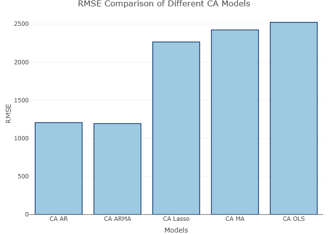
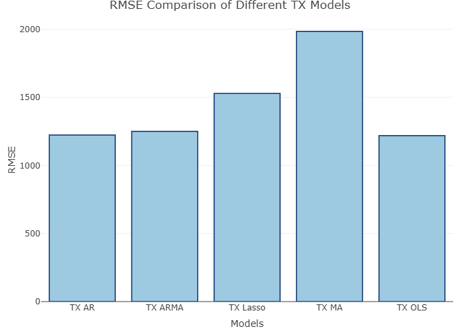
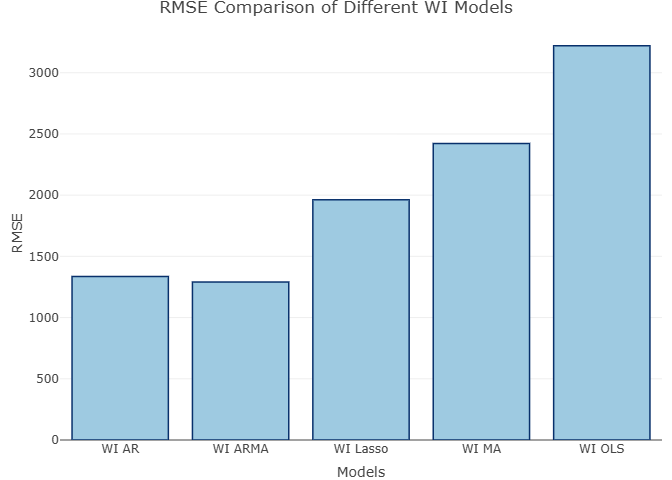
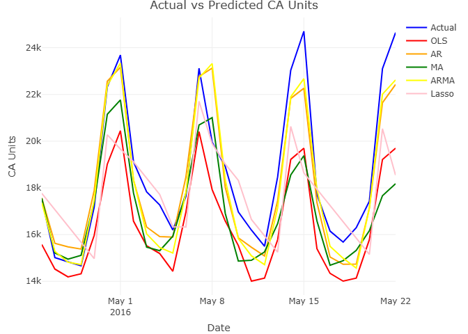
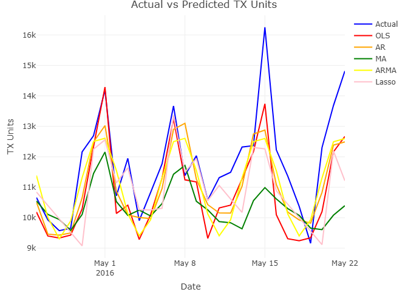
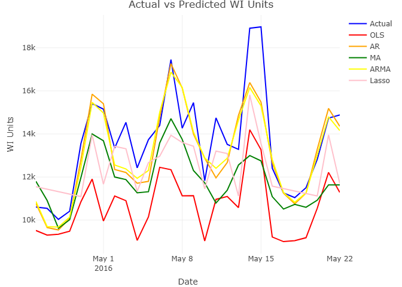

# Walmart Sales Forecasting by State

## Overview
This project predicts weekly Walmart sales across California, Texas, and Wisconsin. Using both **machine learning** and **time series techniques** - including OLS, Lasso regression, and time series models (AR, MA, ARMA), we evaluated predictive accuracy and selected the best-performing models for each state based on RMSE performance. The analysis revealed state-specific shopping patterns, key sales drivers, and seasonality trends that could guide inventory planning, staffing, and promotions.

## Key Insights & Business Relevance

### State-Specific Shopping Patterns
- California and Wisconsin required higher-lag ARMA models, reflecting more concentrated sales in fewer stores.
- Texas required fewer lags, consistent with higher store density and more frequent customer purchases.  
**Business takeaway:** Inventory and staffing can be tailored to state-specific shopping behaviors to reduce stockouts and overstock.

### Sales Drivers Identified
Using Lasso regression, we identified key predictors:
- Holidays
- Pricing
- Weekday of purchase
- SNAP benefits availability including holidays, price, weekday, and SNAP availability.  
**Business takeaway:** Companies can optimize promotions and pricing strategies using these insights to target high-impact periods and customer groups, potentially increasing sales.

### Seasonality & Demand Cycles 
- Weekday-level trends showed predictable weekend peaks and Monday dips.  
**Business takeaway:** Enables better workforce scheduling and delivery planning, aligning resources with expected demand cycles.

### Sample Visualizations
**RMSE Comparison Across Models for Each State**

**Predicted vs Actual Sales for Each State**

### View Full HTML Report
The complete project report, including all analysis and modeling details, can be viewed here:  
[View Full HTML Report](https://kwesibb2.github.io/Walmart-Sales/)

## Technical Skills Demonstrated
- **Time Series Modeling**: AR, MA, ARMA
- **Regularization**: Lasso regression with cross-validation 
- **Model Evaluation**: RMSE-based model evaluation and comparison
- **Data Processing**: Multi-state wrangling and preprocessing
- **Visualization**: Predicted vs Actual sales plots, RMSE comparison bar charts

## Impact Potential
While actual cost or revenue impact was not quantified, the modeling approach provides a foundation for operational improvements, such as reducing excess inventory, optimizing staffing, and informing promotion strategy based on forecasted demand.

## Personal Summary & Individual Contribution
While this project was completed as part of a group collaboration focused on forecasting Walmart's weekly sales by state (California, Texas, Wisconsin) using machine learning, and time series models, my specific contributions included:
- **Modeling** – Built and evaluated ARMA models to capture state-specific sales patterns.
- **Evaluation** – Calculated RMSE values for multiple models and compared predictive performance.
- **Visualization** – Created predicted vs. actual sales plots and RMSE bar charts for clear communication of results.
- **Analysis** – Interpreted model outputs and generated business-relevant insights, including state-level seasonality and optimal promotional timing.

**Key Business Value:**
The insights outlined enable Walmart to:
- Optimize inventory allocation and staffing per state based on sales patterns.
- Target promotions around high-demand periods.
- Improve operational efficiency by anticipating demand fluctuations.

## Acknowledgements
This project was completed in collaboration with [Group Members' Names Removed for Privacy].
Original report files remain unmodified to preserve academic integrity.
